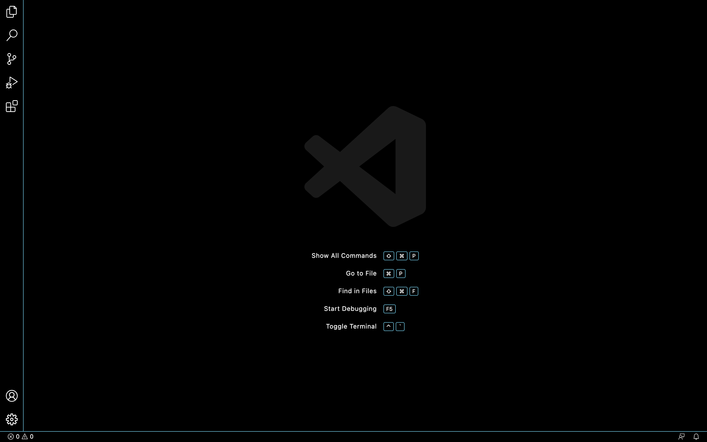
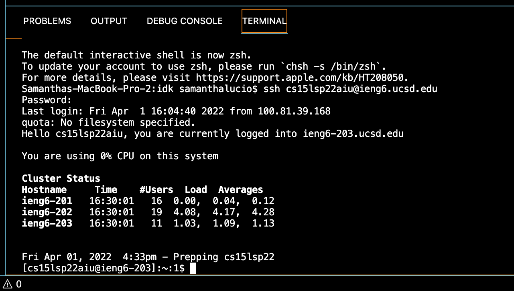
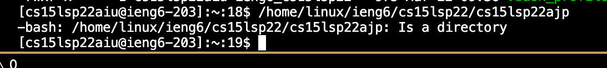

# Week 2 Lab Report

## How to Log Into a Course-Specific Account on ieng6.

## 1. Install VSCode

        Download VSCode with this website link: [Install VSCode]([Link](http://a.com)). Once you install VSCode, you will open the application and see this.

## 2. Remotely Connecting

        First, open the VSCode terminal and type: $ ssh cs15lsp22zz@ieng6.ucsd.edu *** (replace the zz with your actual username). If a question pops up, make sure to type 'y' for yes and input your password. You should see something like this:

## 3. Trying Some Commands

        There are many types of commands you can use like cd, ls, pwd, mkdir, and cp. For example, I used /home/linux/ieng6/cs15lsp22/cs15lsp22abc. In my example, abc was my classmates username and it tells you whether it is a directory or not. 
    

## 4. 
